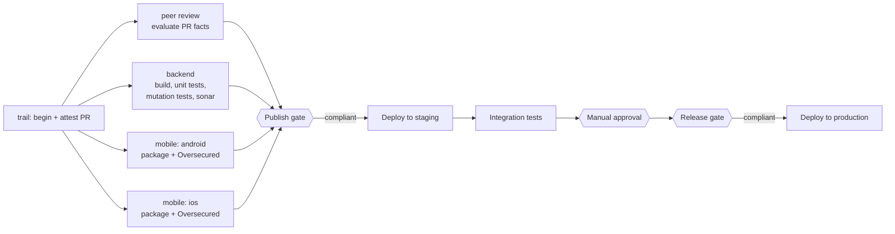

# Kosli demo — Java backend + mobile app

A demo of Kosli governing a two-component system — a Spring Boot backend (**orders-api**) on
Azure App Service and a mobile app (**Mobile Orders**, Android + iOS) — where every control
(peer review, tests, SonarQube, mutation testing, mobile security scan, integration tests,
release approval) is attested to Kosli, and Kosli's policies, not a green pipeline, decide
whether a build may be published and released.

## Build & deploy

One pipeline ([`ci-build.yml`](.github/workflows/ci-build.yml)) runs on every push to `main`,
attesting to one Kosli flow, `order-system-ci`, whose trail is the commit SHA:

- **Publish gate** — `kosli assert artifact --environment azure-appservice-staging` against the staging environment policy: did the build produce
  everything it owed (peer review, unit tests, Sonar quality gate, mutation score, both mobile
  scans)? Passing deploys to **staging**, not production.
- **Release gate** — after a human approves the protected `production-release` environment,
  `kosli assert artifact --environment azure-appservice-prod` judges the build against every
  policy attached to production: everything the publish gate checked, plus a passing
  integration test run and a named approver. Only then does the same build reach **production**.

Full design rationale, setup steps and gotchas: [CLAUDE.md](CLAUDE.md).

## Links

- Sonar: https://sonarcloud.io/project/overview?id=kosli-dev_azure-java-appservice-demo
- Azure Portal: https://portal.azure.com/#@/resource/subscriptions/96cdee58-1fa8-419d-a65a-7233b3465632/resourceGroups/rg-kosli-orders-api-demo/overview
- API URL staging: https://kosli-orders-api-demo-staging.azurewebsites.net
- API URL prod: https://kosli-orders-api-demo.azurewebsites.net

## Demo scenarios

- [x] **Happy case** — a change passes all checks and is deployed to prod
  [CI](https://github.com/kosli-dev/azure-java-appservice-mobileapp-demo/actions/runs/33046726553) ·
  [Trail](https://app.kosli.com/kosli-public/flows/order-system-ci/trails/95db1955d723ff85fbbed6809d6ad52593e3fde9) ·
  [Staging snapshot](https://app.kosli.com/kosli-public/environments/azure-appservice-staging/snapshots/15) ·
  [Prod snapshot](https://app.kosli.com/kosli-public/environments/azure-appservice-prod/snapshots/25)
- [x] **Blocked from staging** — e.g. failed mutation tests
  [CI](https://github.com/kosli-dev/azure-java-appservice-mobileapp-demo/actions/runs/33047624248) ·
  [Trail](https://app.kosli.com/kosli-public/flows/order-system-ci/trails/052ab8b48e278b803b00f5314ce1433f3f945b15)
- [x] **Deployed to staging but blocked from prod** — e.g. failed integration tests
  [CI](https://github.com/kosli-dev/azure-java-appservice-mobileapp-demo/actions/runs/33047905435) ·
  [Trail](https://app.kosli.com/kosli-public/flows/order-system-ci/trails/bc6b6fb7e8f41800b4092a625398b636f1f9e4e7) ·
  [Staging snapshot](https://app.kosli.com/kosli-public/environments/azure-appservice-staging/snapshots/16)
- [x] **Peer review control unsatisfied** — a committer approves their own PR
  [PR](https://github.com/kosli-dev/azure-java-appservice-mobileapp-demo/pull/48) ·
  [CI](https://github.com/kosli-dev/azure-java-appservice-mobileapp-demo/actions/runs/33048499635) ·
  [Trail](https://app.kosli.com/kosli-public/flows/order-system-ci/trails/04a93ece0964475f5eb8f21a864da05932fa4c05)
- [x] **Mutation tests fail but are overridden, then deployed to staging and prod**
  [CI original failure](https://github.com/kosli-dev/azure-java-appservice-mobileapp-demo/actions/runs/33048715370/attempts/1) ·
  [CI attestation override](https://github.com/kosli-dev/azure-java-appservice-mobileapp-demo/actions/runs/33048938814) ·
  [CI re-run to deploy](https://github.com/kosli-dev/azure-java-appservice-mobileapp-demo/actions/runs/33048715370/attempts/2) ·
  [Trail](https://app.kosli.com/kosli-public/flows/order-system-ci/trails/49306b8dd8cd0e20bd5e40e9940d8b81488cab3a)
